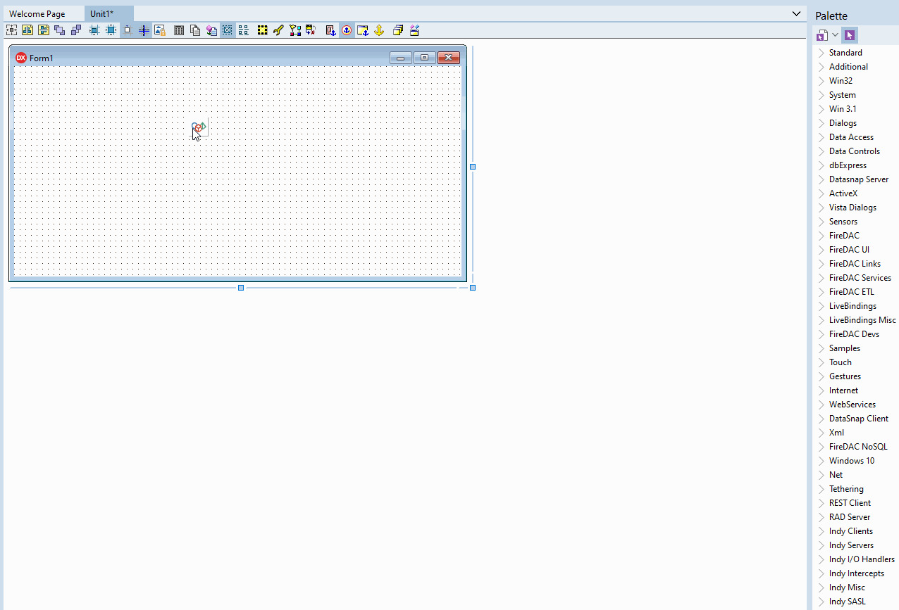

# SQLCollection
SQLCollection allows you to centralize your SQL scripts to facilitate code organization and maintenance

The main feature of SQLCollection is its editor. With the SQLCollection editor you can add items to your collection in a simple and intuitive way. You can edit the SQLs with syntax highlighting.

## How to install

Open `.\packages\SQLCollectionGroup.groupproj`

Build and Install `SQLCollection.dpk` and `SQLCollectionDesign.dpk`

Add `.\sources` to delphi library path.

## Requires
* [SynEdit](https://github.com/SynEdit/SynEdit): SynEdit is used in the SQL editor to provide syntax highlighting

## Delphi versions
It was tested on delphi 10.3 Rio. But it should work easily in the versions of Delphi XE7 above.